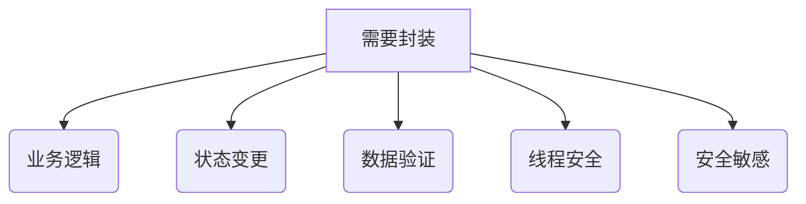

# 项目编码规范

## 1. 命名规范

### 1.1 命名规则表
| 作用域                | 元素               | 命名规则          | 说明与示例                          |
|--------------------|--------------------|-------------------|-------------------------------------|
| 全局                 | 类名               | PascalCase        | DatabaseService, UserManager        |
| 全局                 | 抽象类             | Abstract+Pascal   | AbstractConnection, BaseHandler     |
| 全局                 | 接口               | PascalCase        | Runnable, DataParser                |
| 全局                 | 枚举类型           | PascalCase        | ErrorCode, ColorMode                |
| 全局                 | 异常类             | PascalCase        | ValidationException, TimeoutError   |
| 全局                 | 常量               | UPPER_SNAKE_CASE  | MAX_RETRY_COUNT, API_TIMEOUT_MS     |
| 全局                 | 变量               | snake_case        | global_config, instance_count       |
| 全局                 | 函数               | snake_case        | (JS/Python) validate_input, get_timestamp |
| Java包              | 类文件             | PascalCase        | Logger.java, Config.java            |
| JavaScript/Python包 | 类文件             | snake_case        | logger.js, config.py                |
| Java包               | 包名               | 全小写+点分隔     | com.utils, org.example.core         |
| JavaScript/Python包          | 模块名             | snake_case        | data_utils.py, http_service.js      |
| 类内部                | 静态属性           | PascalCase        | DefaultConfig, ConnectionPool       |
| 类内部                | 静态Getter         | PascalCase        | Instance, ApiKey                    |
| 类内部                | 静态Setter         | PascalCase        | Instance(value), ApiKey(key)        |
| 类内部                | 静态方法           | PascalCase        | CreateInstance, ValidateInput       |
| 类内部                | 常量               | UPPER_SNAKE_CASE  | DEFAULT_TIMEOUT, MAX_CONNECTIONS    |
| 类内部                | 实例属性           | snake_case        | user_profile, connection_pool       |
| 类内部                | Java实例Getter     | get+属性名       | getUserProfile(), getConnectionPool() |
| 类内部                | Java实例Setter     | set+属性名       | setUserProfile(val), setConnectionPool(val) |
| 类内部                | JavaScript实例Getter       | 属性访问器       | user_profile, connection_pool       |
| 类内部                | JavaScript实例Setter       | 属性访问器       | user_profile = val, connection_pool = val |
| 类内部                | Python实例Getter   | 属性装饰器       | user_profile, connection_pool       |
| 类内部                | Java布尔Getter     | is+属性名        | isActive(), isValid()               |
| 类内部                | JavaScript布尔Getter       | is_前缀+属性     | is_active, is_valid                 |
| 类内部                | Python布尔Getter   | is_前缀+属性     | is_active, is_valid                 |
| 类内部                | Java私有成员       | _前缀            | _internalCache, _resetCounters()    |
| 类内部                | JavaScript私有成员         | #前缀            | #internal_data, #load_config()      |
| 类内部                | Python私有成员     | _前缀            | _internal_cache, _reset_counters()  |
| 类内部                | Java实例方法       | camelCase         | updateProfile, calculateTotal       |
| 类内部                | JavaScript实例方法         | snake_case        | update_profile, calculate_total     |
| 类内部                | Python实例方法     | snake_case        | update_profile, calculate_total     |
| 类内部                | 枚举成员           | UPPER_SNAKE_CASE  | SUCCESS, NOT_FOUND                  |
| 局部                 | 变量               | snake_case        | temp_buffer, retry_count            |
| 局部                 | 布尔变量           | is_前缀+snake_case| is_valid, has_permission            |
| 测试代码               | 测试类             | PascalCase+Test  | UserServiceTest.java                |
| 测试代码               | 测试方法           | snake_case       | test_user_creation()                |
| 项目                 | 配置文件           | kebab-case       | app-config.yaml, db-setup.toml      |
| 项目                 | 资源文件           | kebab-case       | user-avatar.png, icon-sprite.svg    |

### 1.2 命名原则说明
- **Getter/Setter规则**：
    - **Java**：
        - 必须使用 `get`/`set` 前缀（除非使用Lombok等注解）
        - 布尔Getter使用 `is` 前缀（`isActive()`）
        - 示例：`user.getProfile()`, `config.setTimeout(100)`

    - **JavaScript/Python**：
        - 直接使用目标名词，不加`get`/`set`前缀
        - JS：属性访问器（`user.profile`）
        - Python：属性装饰器（`user.profile`）

    - **静态Getter/Setter**（所有语言）：
        - 使用PascalCase（如：`Config.ApiKey`）
        - 不加`get`/`set`前缀

- **类与接口命名**：
    - 类名使用名词或名词短语（`PaymentProcessor`）
    - 抽象类名使用`Abstract`前缀（`AbstractConnection`）
    - 接口名使用能力描述（`Runnable`，`Serializable`）
    - 异常类名以`Exception`/`Error`结尾（`ValidationException`）

- **方法命名**：
    - 普通方法使用动词或动词短语（`calculate_total()`）
    - 转换方法使用`To`前缀（`ToString()`，`ToJson()`）
    - 避免不必要的冗长命名（避免`Logger.CreateLogger()`, 使用`logger.Create()`）

- **布尔类型特殊规则**：
    - **所有布尔值相关元素**使用 `is_`、`has_`、`can_` 等前缀：
        - Java布尔Getter：`isActive()`
        - JS/Python布尔Getter：`is_active`
        - 布尔方法：`is_valid()`
        - 布尔变量：`is_valid`

- **其他原则**：
    - 避免使用缩写，除非是广泛接受的（如 HTTP、ID）
    - 避免使用数字作为任何命名（如：`count1`，`count2`）
    - 局部变量避免不必要的冗长命名（避免：`logger_instance`，使用`logger`)
    - 避免单个字符命名（除循环计数器`i`、坐标`x/y`等）
    - 时间单位在变量名中显式标注（`timeout_ms`，`cache_ttl_sec`）

- **领域驱动设计(DDD)命名**：

  | 元素         | 命名模式                  | 示例                     |
  |--------------|---------------------------|--------------------------|
  | 实体         | 领域对象名词              | `User`, `Order`          |
  | 值对象       | 描述性名词                | `Address`, `Money`       |
  | 领域服务     | `Manager`/`Service`后缀   | `PaymentManager`         |
  | 仓库         | `Repository`后缀          | `UserRepository`         |
  | 领域事件     | 过去时动词                | `OrderCancelled`         |

---

## 2. 封装性

### 2.1 基本原则

- **默认私有**：所有字段（包括配置字段）默认设为 `private`。  
  > **注意**：配置字段必须通过 Getter 访问，禁止直接访问字段。
- **受控访问**：通过方法暴露必要访问
- **不可变设计**：允许公开的字段使用 `final`
- **集合类型保护** ：集合类型字段使用 `Collections.unmodifiableList()`
- **继承设计**: 对需要封装的类使用 `final`
- **构造函数**：不允许在构造函数中暴露内部可变对象引用
- **公开字段文档**：明确说明使用约束
- **多线程环境**：使用 `volatile` 或原子类
#### 必须封装的场景

> **设计原则**：封装程度应与类的重要性成正比，核心组件应实施最严格的访问控制。
### 2.2 类封装规范
- **面向对象原则**: 对常用的属性字段需和它相相关性很强的字段进行组封装。
#### 配置类
**核心原则**：配置字段必须通过Getter访问，禁止直接访问字段

| 配置类型       | 访问方式          | 命名规则          | 示例代码                          |
|----------------|-------------------|-------------------|-----------------------------------|
| 环境变量       | 静态Getter        | PascalCase        | Java:`Config.ApiKey()` Python: `Config.ApiKey`                 |
| 内存配置       | 静态Getter        | PascalCase        | Java:`Config.MaxConnections()` Python: `Config.MaxConnections`         |
| 文件/DB配置    | 实例Getter        | 语言规范          | Java: `config.getTimeout()` Python: `config.timeout` |
| 动态配置       | 实例方法          | 语言规范          | `config.getLatestRate()`          |

**实现要求**：
1.对于外部内存配置，请使用静态Getter。
2.Getter禁止在业务逻辑中直接从外部配置中获取。
3.内部需要包含一个Constant类，用于存储默认值和Getter的逻辑扩展。
4.敏感配置的Getter需要有默认值
