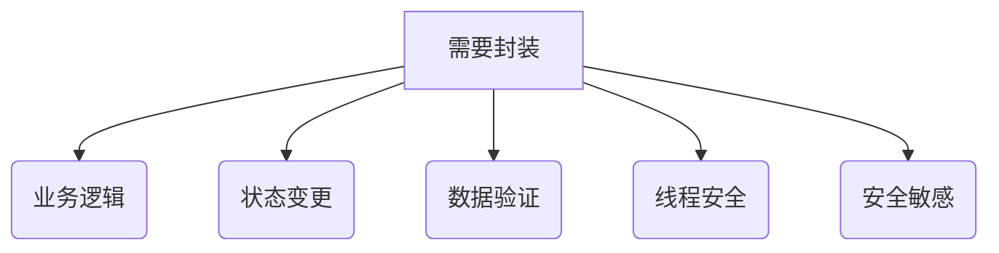

# 项目编码规范

## 1. 命名规范

### 1.1 命名规则表
| 作用域       | 元素               | 命名规则        | 说明与示例                          |
|--------------|--------------------|-----------------|-------------------------------------|
| 全局         | 类名               | PascalCase      | DatabaseService, UserManager        |
| Java         | 类文件             | PascalCase      | Logger.java, Config.java            |
| JS/Python    | 类文件             | snake_case      | logger.js, config.py                |
| 全局         | 常量               | UPPER_SNAKE_CASE| MAX_RETRY_COUNT, API_TIMEOUT_MS     |
| 类内部       | 静态属性           | PascalCase      | DefaultConfig, ConnectionPool       |
| 类内部       | 静态方法           | PascalCase      | CreateInstance, ValidateInput       |
| 类内部       | 常量               | PascalCase      | DefaultTimeout, MaxConnections      |
| 类内部       | 实例变量           | snake_case      | user_profile, connection_pool       |
| 类内部       | 实例属性           | snake_case      | session_token, transaction_id       |
| 类内部       | 私有变量           | snake_case      | _internal_cache, #connection_state  |
| 方法/函数    | 方法名             | snake_case      | validate_user, calculate_total      |
| 方法/函数    | 参数名             | snake_case      | input_data, max_retries             |
| 方法/函数    | 局部变量           | snake_case      | temp_result, item_count             |

### 1.2 命名原则说明
- **PascalCase**：每个单词首字母大写，无分隔符
- **snake_case**：所有字母小写，单词间用下划线连接
- **UPPER_SNAKE_CASE**：所有字母大写，单词间用下划线连接
- 类名应使用名词或名词短语
- 方法名应使用动词或动词短语
- 布尔变量/方法应使用 `is_`、`has_`、`can_` 等前缀
- 避免使用缩写，除非是广泛接受的（如 HTTP、ID）

---

## 2. 封装性

### 2.1 封装规则表
| 场景                        | 是否允许公共实例变量 | 理由                          |
|-----------------------------|----------------------|-------------------------------|
| 不可变数据                  | 是                   | 数据不可变，外部无需修改       |
| 配置类/DTO                  | 是                   | 核心职责是存储和传递数据       |
| 小型工具类                  | 是                   | 简化小型项目或脚本的代码       |
| 包含业务逻辑的类            | 否                   | 需要维护内部状态               |
| 包含副作用的方法            | 否                   | 防止外部误用                   |
| 需要验证的数据              | 否                   | 需要范围检查或格式验证         |
| 涉及安全性或数据完整性      | 否                   | 防止敏感数据泄露               |
| 服务类和核心组件            | 否                   | 确保系统稳定性                 |
| 多线程或并发环境            | 否                   | 确保线程安全                   |

### 2.2 封装原则说明

#### 2.2.1 允许公开的情况
- 当数据天然具有不可变性（如final常量）
- 纯数据载体（DTO/Value Objects）
- 无状态工具类（如MathUtils）

#### 2.2.2 必须封装的场景

### 2.3 实现准则

#### 2.3.1 基本原则
- 默认私有：所有字段默认设为 private

```java
private String internalState;
```
- 受控访问：通过方法暴露必要访问

```java
public String getName() {
    return this.name;
}

public void setAge(int age) {
    if (age < 0) throw new IllegalArgumentException();
    this.age = age;
}
```
- 不可变设计：允许公开的字段使用 final

```java
public final class Constants {
    public static final int MAX_RETRIES = 3;
}
```
#### 2.3.2 集合类型保护
```java
public class SecureCollection {
    private List<String> sensitiveData = new ArrayList<>();
    
    public List<String> getData() {
        return Collections.unmodifiableList(new ArrayList<>(sensitiveData));
    }
    
    public void addData(String item) {
        if (item == null || item.trim().isEmpty()) {
            throw new IllegalArgumentException("无效数据");
        }
        sensitiveData.add(item);
    }
}
```
#### 2.3.3 DTO 实现示例
```java
public final class AppConfig {
    public final String appName;
    public final int timeoutSeconds;
    
    public AppConfig(String appName, int timeoutSeconds) {
        if (appName == null || appName.isEmpty()) {
            throw new IllegalArgumentException("应用名无效");
        }
        if (timeoutSeconds <= 0) {
            throw new IllegalArgumentException("超时时间必须为正数");
        }
        
        this.appName = appName;
        this.timeoutSeconds = timeoutSeconds;
    }
}
```
### 2.4 注意事项
| 场景                  | 推荐做法                          | 避免做法                  |
|-----------------------|-----------------------------------|---------------------------|
| 公开字段文档          | 明确说明使用约束                  | 无文档说明                |
| 构造函数              | 不暴露内部可变对象引用            | 直接暴露内部集合引用      |
| 多线程环境            | 使用 `volatile`/原子类            | 未做同步处理              |
| 集合返回              | 返回不可修改副本                  | 直接返回原始集合引用      |
| 继承设计              | 对需要封装的类使用 `final`        | 允许不可控的子类修改      |

> **设计原则**：封装程度应与类的重要性成正比，核心组件应实施最严格的访问控制。