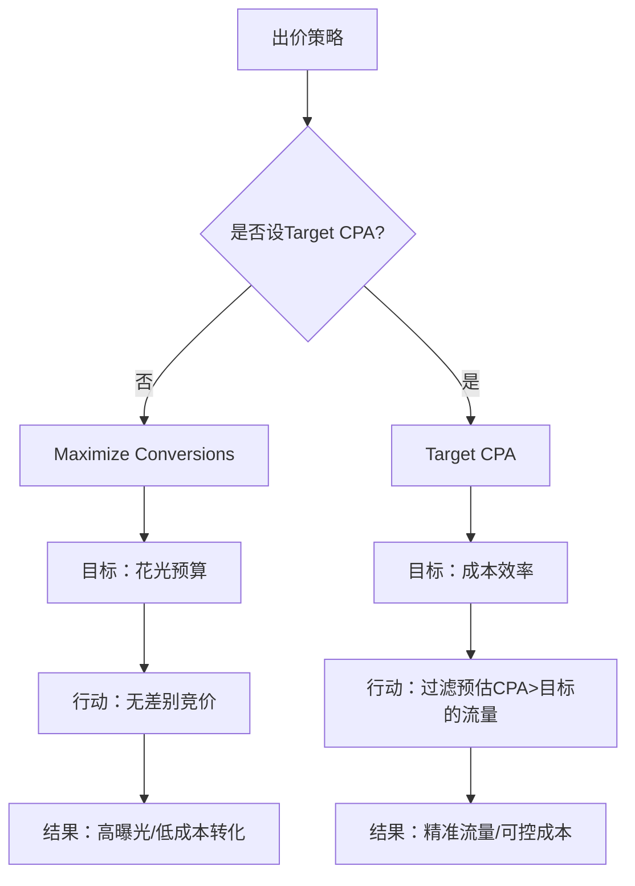
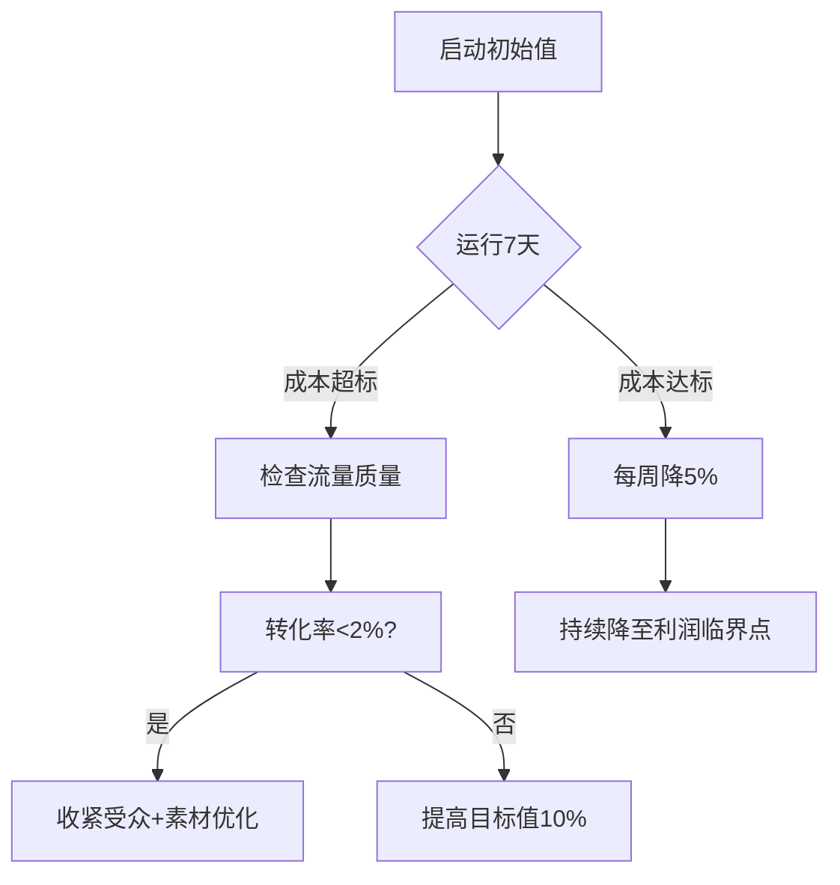

Bidding: 
Maximize Conversions
Target CPA:
## 1. 出价策略的影响：
 - 出价过低可能会导致排名落后
### 表1：Target CPA 高低设置对比
| **维度**         | **Target CPA 设置较高**                | **Target CPA 设置较低**                |
|------------------|---------------------------------------|----------------------------------------|
| **核心目标**     | 获取更多转化量                          | 严格控制转化成本                       |
| **流量特征**     | 范围更广，包含中低意向用户               | 高度精准，聚焦高意向用户                |
| **点击率(CTR)**  | 中等（流量较泛化）                      | 较高（精准流量占比提升）                |
| **转化量**       | ▲ 较高（转化门槛放宽）                  | ▼ 较低（初期可能减少）                  |
| **转化成本**     | 接近设定目标值（如$50）                 | 严格控制在设定目标值（如$30）           |
| **曝光量**       | ▲▲ 较高（竞价更积极）                  | ▼ 较低（过滤低效曝光）                 |
| **风险**         | 可能获得部分低质量转化                  | 可能错失高价值但略超目标的机会          |
| **最佳场景**     | 预算充足/品牌推广阶段                   | 严格ROI要求/新学习期                   |

---

### 表2：Maximize Conversions vs Target CPA 策略对比
| **维度**         | **Maximize Conversions（无Target CPA）** | **Target CPA（任何设置）**             |
|------------------|------------------------------------------|----------------------------------------|
| **核心机制**     | 花光预算获取最大转化量                    | 在目标成本内获取最大转化量              |
| **曝光量**       | ▲▲ 极高（激进竞价）                      | ▼ 降低20-50%（过滤低效曝光）           |
| **点击率(CTR)**  | ▼ 低（常<0.2%，流量泛化）                | ▲ 较高（常>0.5%，流量精准化）          |
| **转化量**       | ▲ 初期可能较高（无过滤）                  | ▼ 初期可能下降 → ▲ 后期回升（优化后）   |
| **转化成本**     | 不可控（常超合理值50-200%）              | 稳定在目标值±20%范围内                 |
| **预算消耗**     | 100%花光（即使低效）                     | 可能花不完（严格过滤）                  |
| **学习期**       | 2-3天（快速花钱）                        | 7-14天（需积累优质数据）                |
| **您案例表现**   | 37.7k曝光→55点击→2转化($80/个)           | 预估：15k曝光→40点击→3转化($50/个)      |
| **风险**         | 预算越高亏损越大                          | 目标过严导致转化量不足                  |
| **优化本质**     | 数量优先                                  | 效率优先                                |

---


## 2.计算公式

### 一、基础计算公式（必用）
**$$ \text{Target CPA} = \frac{\text{客户终身价值（LTV）} \times \text{目标利润率}}{ \text{平均转化次数} } $$**
* **示例**：
    - 客户LTV = $300（3年内总消费）
    - 目标利润率 = 20%
    - 平均需2次转化（1次咨询+1次购买）  
      $$ \text{Target CPA} = \frac{300 \times 20\%}{2} = \frac{60}{2} = $30 $$

---

### 二、分步骤确定流程
#### 步骤1：计算真实转化价值
| 转化类型       | 分配权重 | 计算方式                     | 示例值  |
|----------------|----------|----------------------------|---------|
| 电话咨询       | 40%      | 历史成交客户中来自电话的比例 | $50/次 |
| 表单提交       | 30%      | 平均带来$30毛利             | $30/次 |
| 在线购买       | 30%      | 直接订单利润                | $80/次 |
| **加权平均价值** | -        | `=(50×0.4)+(30×0.3)+(80×0.3)` | **$53** |

> ✅ **工具**：Google Analytics 4（GA4）中的[归因模型分析](https://analytics.google.com/)

---

#### 步骤2：确定利润安全边际
```python
# 伪代码：动态CPA计算器
max_acceptable_cpa = 加权平均价值 * 0.7  # 保留30%利润空间
if 当前CPA > max_acceptable_cpa:
    target_cpa = 当前CPA * 0.8  # 分阶段下调
else:
    target_cpa = max_acceptable_cpa
```
* **输出**：若当前CPA=$80，则初始Target CPA=$64（下降20%）

---

#### 步骤3：历史数据基准法
| 数据源               | 计算公式                     | 示例   |
|----------------------|----------------------------|--------|
| 过去30天平均CPA      | `=AVERAGE(转化成本列)`      | $48.2  |
| 最佳20%转化成本      | `=PERCENTILE(成本列,0.2)`   | $36.5  |
| **推荐Target CPA**   | `=MIN(平均CPA×0.8, 最佳20%)` | **$36.5** |

> ✅ **工具**：Google Ads报告 → 筛选“转化成本≤最佳20%”的日期数据

---

#### 步骤4：竞争对手对标法
1. 使用[Semrush](https://www.semrush.com/)获取行业CPA基准：
   | 行业         | 平均CPA | 头部企业CPA |
   |--------------|---------|------------|
   | 法律服务     | $45     | $32        |
   | 电商家居     | $22     | $15        |
2. 设定：`目标CPA = 行业头部CPA × 1.2`（示例：$32×1.2=$38.4）

---

#### 步骤5：增量测试策略


---

### 三、特殊场景处理
#### 场景1：新账户无历史数据
- **临时公式**：  
  `Target CPA = 产品最低毛利 × 0.5`  
  （例：产品毛利$60 → 目标CPA=$30）
- **快速积累数据**：  
  前3天用Maximize Conversions + 限制预算（$50/天），获取20+转化后切换Target CPA

#### 场景2：多转化类型差异大
| 转化动作   | 独立Target CPA | 逻辑                          |
|------------|----------------|-----------------------------|
| 高价值转化 | $80            | 针对购买/预约等高利润动作       |
| 低价值转化 | $15            | 针对页面浏览等引流动作          |
> ⚠️ 需在Google Ads中为不同转化动作单独设置出价策略

---

### 四、验证与调优表
| 周期   | 检查项                  | 健康标准         | 调整动作                     |
|--------|------------------------|----------------|----------------------------|
| 每日   | CPA vs Target CPA      | ±15%以内       | 波动>20%时检查流量来源       |
| 每周   | 转化率(CR)             | >行业平均1.5倍 | CR下降则优化落地页           |
| 每两周 | 新转化成本百分位       | 前30%成本占比↑ | 淘汰后50%成本的受众/设备类型 |
| 每月   | LTV/CPA比值            | ≥3.0           | <2.0时重新计算目标值         |

---

### 五、终极校验公式
**$$ \text{Target CPA} \leq \frac{\text{广告支出}}{\text{转化次数}} \times \frac{\text{目标ROAS}}{ \text{实际ROAS} } $$**
* **示例**：当前ROAS=180%，目标ROAS=250%，当前CPA=$45  
  $$ \text{新Target CPA} = 45 \times \frac{180\%}{250\%} = $32.4 $$

> ✨ **操作建议**：
> 1. 先用**步骤3的历史数据法**设定初始值
> 2. 按**步骤5的增量测试**每周优化
> 3. 每月用**终极校验公式**复核合理性