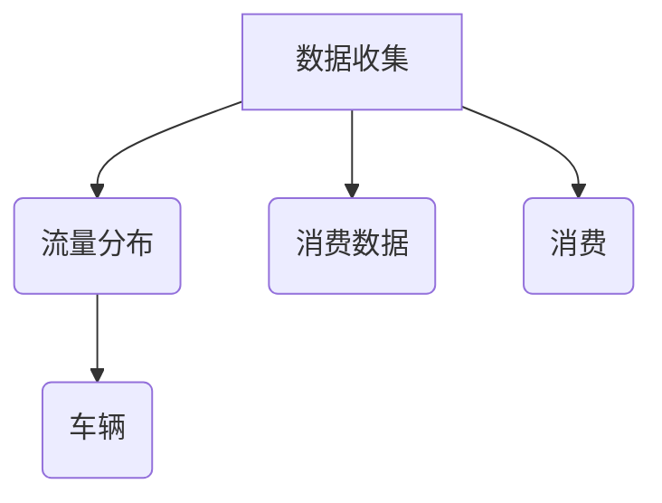
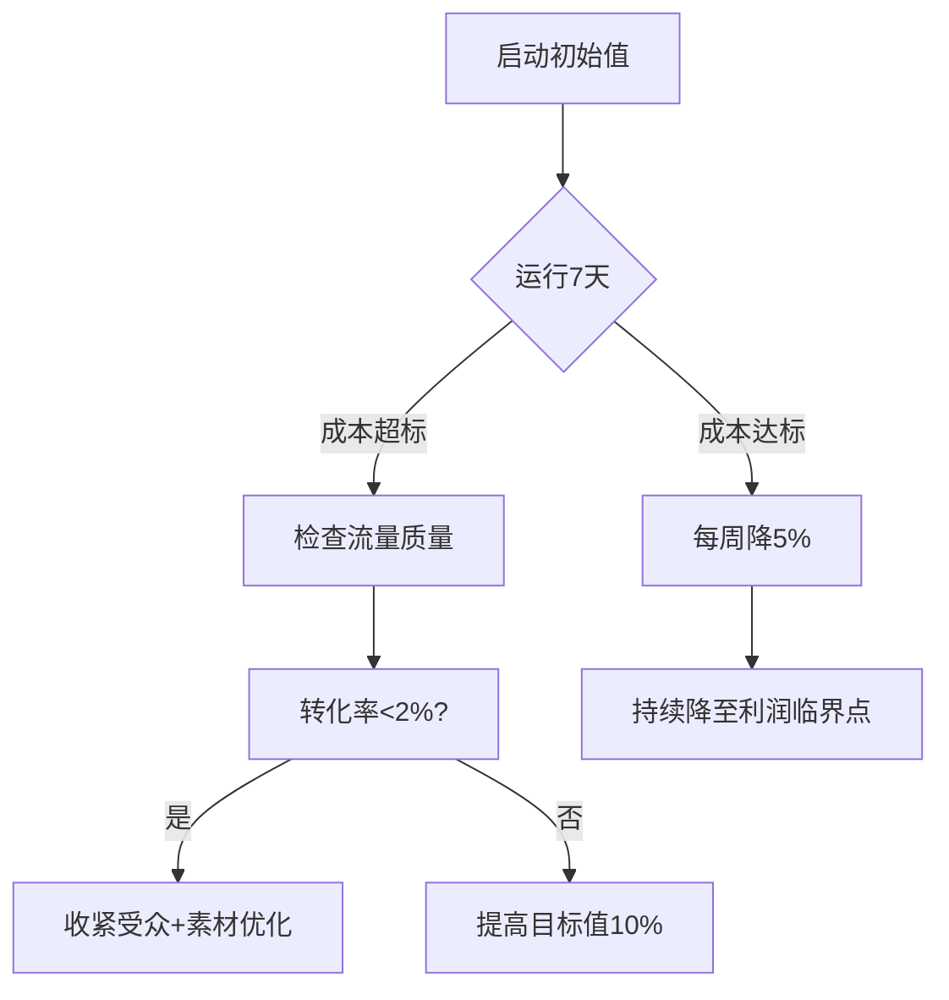

# TODO:

## 1.数据调研

```mermaid
graph TD
    A[数据收集] --> B1(流量分布) 
    B1 --> C(车辆)
    A --> B2(消费数据)
    A --> B3(消费)
```

[Virginia 2025 年的新变化](https://pressroom.virginia.org/whatsnew/)

```mermaid
graph TD
    A[启动初始值] --> B{运行7天}
    B -->|成本达标| C[每周降5%]
    B -->|成本超标| D[检查流量质量]
    D --> E[转化率<2%?]
    E -->|是| F[收紧受众+素材优化]
    E -->|否| G[提高目标值10%]
    C --> H[持续降至利润临界点]
```